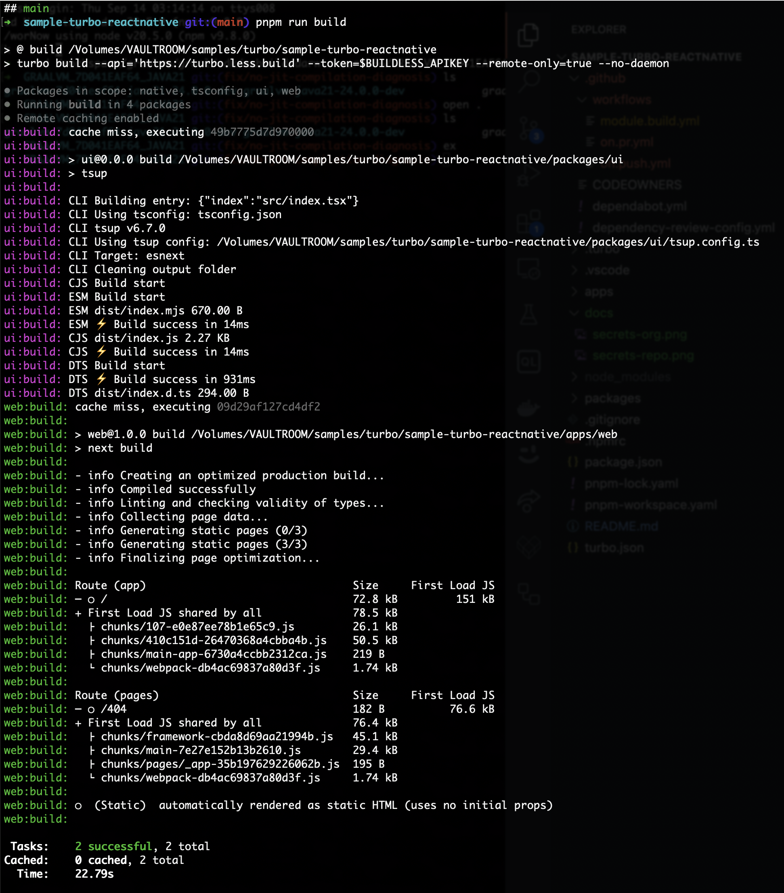
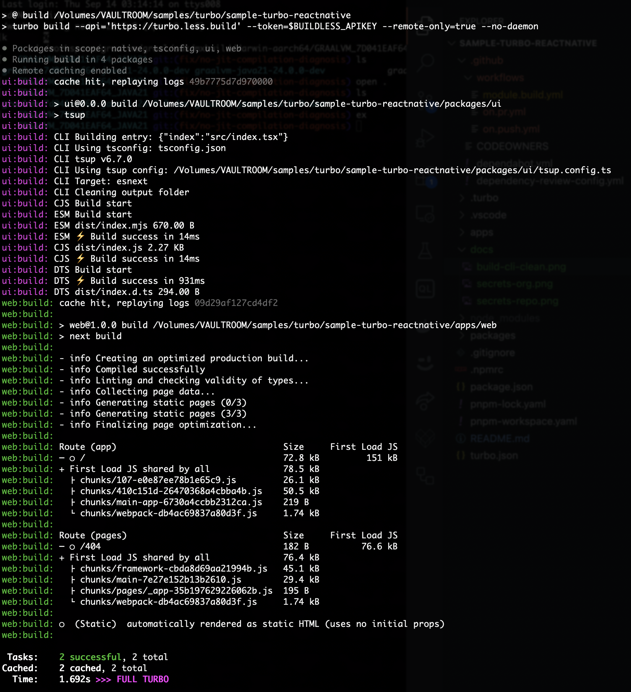

# turborepo + react native sample

[Buildless][1], [Pkgst][8], [Turbo][2], and [React Native][3] with [sccache][4].

> See [a video preview][13] of this sample on the command line

| Uncached build (**22 seconds**) | Cached build (**1.5 seconds**) |
| -------------- | ------------ |
|  |  |


## Details about this sample

Together, these tools provide a unified cross-platform development environment, enabled with blazing-fast remote build caching. Turbo handles build caching for the web portion of the app. `sccache` kicks in for Swift builds.


### Additional resources

- [Buildless docs: Turborepo setup][7]
- [Swift docs: Using `sccache`][5]
- [Turbo docs: Remote caching][9]


## Trying the sample

> **Before you start:** Obtain an API key for [Buildless][1], set it at `BUILDLESS_APIKEY` in your environment

1) Clone the sample, install dependencies with `pnpm i`
2) Run a build with `pnpm run build`; observe that Turbo uses Buildless
3) Set up [`sccache`][4], and [link it to your Swift toolchain][5], configure [caching with Redis][14]

That's it! Enjoy lightning-fast builds on all platforms 🔥


### Building and running each app

> To run the web app:
```
pnpm run dev
```

> To run the iOS app:
```
pnpm run ios
```

> To run the Android app:
```
pnpm run android
```


## Using the sample for your own codebase

This is a [GitHub Template repository][10]; you can easily use it to create your own repo. Follow these steps to customize it
for use with your Buildless account:

1) Update `.github/CODEOWNERS`
2) Add a [GitHub Secret][11] called `BUILDLESS_APIKEY`, set to the API key you want to use in CI
3) That's it!


### Sharing an API key across an organization

You can use [Organization Secrets][12] to automatically provide a `BUILDLESS_APIKEY` to all your repos.


## Docs from the original template

This template is a fork of [a similar Vercel-provided template][6]. The original README docs from that template are enclosed below.

### What's inside?

This Turborepo includes the following packages/apps:

### Apps and Packages

- `native`: a [react-native](https://reactnative.dev/) app built with [expo](https://docs.expo.dev/)
- `web`: a [Next.js](https://nextjs.org/) app built with [react-native-web](https://necolas.github.io/react-native-web/)
- `ui`: a stub [react-native](https://reactnative.dev/) component library shared by both `web` and `native` applications
- `tsconfig`: `tsconfig.json`s used throughout the monorepo

Each package/app is 100% [TypeScript](https://www.typescriptlang.org/).

### Utilities

This Turborepo has some additional tools already setup for you:

- [Expo](https://docs.expo.dev/) for native development
- [TypeScript](https://www.typescriptlang.org/) for static type checking
- [Prettier](https://prettier.io) for code formatting


## Video preview

[](https://asciinema.org/a/608260)


[1]: https://less.build
[2]: https://turbo.build
[3]: https://reactnative.dev
[4]: https://github.com/mozilla/sccache
[5]: https://github.com/apple/swift/blob/main/docs/DevelopmentTips.md#use-sccache-to-cache-build-artifacts
[6]: https://vercel.com/templates/next.js/turborepo-react-native
[7]: https://docs.less.build/docs/turborepo
[8]: https://docs.less.build/docs/pkgst
[9]: https://turbo.build/repo/docs/core-concepts/remote-caching
[10]: https://docs.github.com/en/repositories/creating-and-managing-repositories/creating-a-repository-from-a-template
[11]: https://docs.github.com/en/actions/security-guides/using-secrets-in-github-actions
[12]: https://docs.github.com/en/actions/security-guides/using-secrets-in-github-actions#creating-secrets-for-an-organization
[13]: https://asciinema.org/a/608260
[14]: https://docs.less.build/docs/redis
